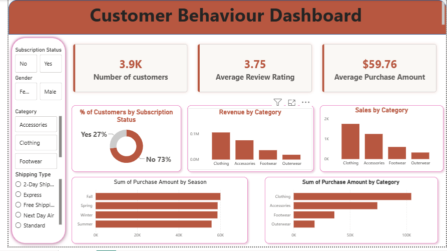
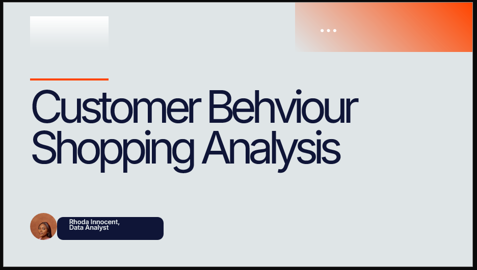

# Customer Shopping Behaviour Analysis

## Overview

This project analyzes customer shopping behavior to uncover purchasing patterns, customer preferences, and revenue drivers. Using Python, MySQL, and Power BI, the analysis transforms raw transaction data into actionable business insights that support data-driven decision-making.

## Dashboard Preview

  

## Business Objectives

The analysis aims to answer key business questions, including:

- Which customer segments generate the highest revenue?
- Which product categories perform best?
- How do subscriptions influence customer spending?
- Which products rely most on discounts?
- How can customer retention and repeat purchases be improved?

## Dataset

The dataset contains **3,000 customer shopping transactions** with information on: Customer demographics, Product categories, Purchase amount, Subscription status, Discounts, Shipping type, Payment methods, Customer ratings, Purchase history

## Tools & Technologies

- Python (Pandas, Matplotlib)
- MySQL
- Power BI
- Jupyter Notebook

## Project Workflow

- Data Cleaning & Preprocessing
- Exploratory Data Analysis (EDA)
- SQL Business Analysis
- Data Visualization
- Power BI Dashboard Development
- Executive Reporting

## Key Insights

- Clothing was the highest-performing product category.
- Female customers generated a significant share of total revenue.
- Subscription customers spent more than non-subscribers.
- Customer segmentation revealed opportunities to improve retention.
- High-value age groups contributed the highest revenue.
- Discounts influenced purchasing decisions across several products.

## Business Recommendations

- Leverage the high-performing Clothing category to cross-sell complementary products.
- Increase customer retention through targeted lifecycle marketing.
- Develop marketing campaigns tailored to female customers.
- Promote top-selling products across marketing channels.
- Reward loyal customers with exclusive benefits and referral incentives.
- Convert new and returning customers into loyal buyers through personalized post-purchase engagement.
- Prioritize high-value customer segments with targeted promotions.

## Executive Report

  

This project includes an executive report that summarizes the business problem, methodology, key findings, dashboard, recommendations, and conclusion.

**View the report here:**

[Customer Shopping Behaviour Analysis.pdf](Customer%20Shopping%20Behaviour%20Analysis%20.pdf)
---

## Skills Demonstrated

- Data Wrangling
- Exploratory Data Analysis (EDA)
- SQL
- Data Visualization
- Business Intelligence
- Python
- Business Storytelling

---

## Author

**Rhoda Innocent**  
Email: innocentrhoda54@gmail.com
Contact: +2348169818758
**LinkedIn:** *[Rhoda Innocent](https://www.linkedin.com/in/rhoda-innocent-983a481ba?utm_source=share_via&utm_content=profile&utm_medium=member_android)*

---
